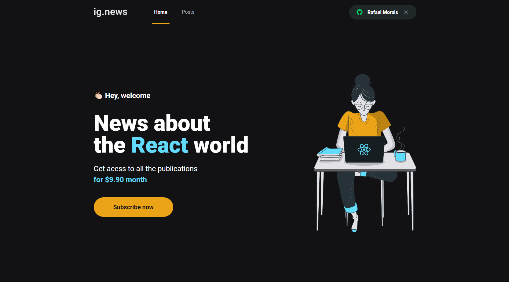
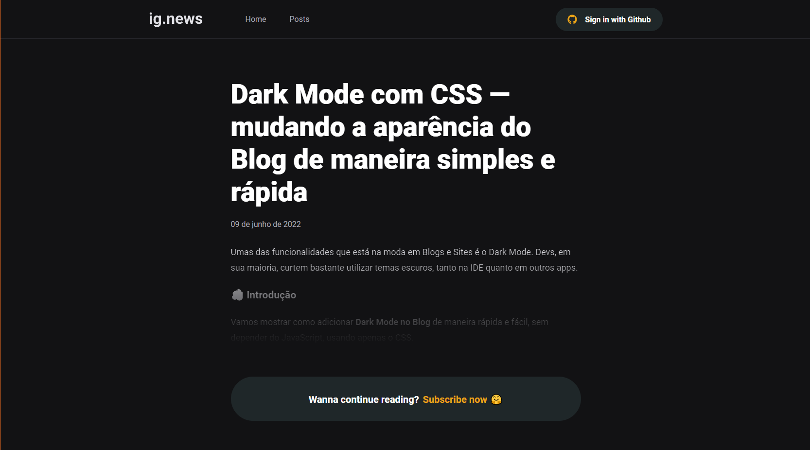
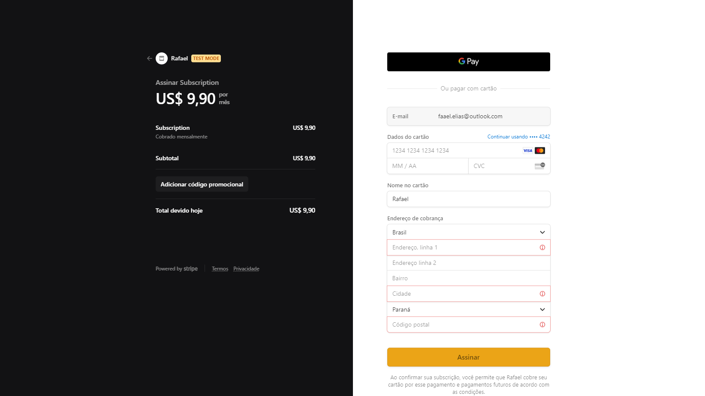

<h1 align="center"> ig.news </h1>
<br><br>
<p align="center">
 <a href="#sobre-o-projeto">Sobre o Projeto</a> •
 <a href="#tecnologias">Tecnologias</a> •
 <a href="#imagens">Imagens</a> •
 <a href="#requisitos">Requisitos</a> •
 <a href="#licença">Licença</a> •
 <a href="#autor">Autor</a>
</p>

<br>

## Sobre o projeto

Esse projeto foi desenvolvido como prática das aulas do modulo 03 do [Ignite da Rocketseat](https://rocketseat.com.br/).
<br><br>
O projeto é um blog que possui um sistema de compra integrado ao Stripe. Após realizar o pagamento sua inscrição estará ativa e pronta para visualizar o conteúdo completo de todo o blog. Caso o usuário não deseje optar pela assinatura, ele terá acesso limitado ao conteúdo das postagens. Os meios de pagamento da aplicação são integrados com a API do Stripe, juntamente do FaunaDB para armazenar as informações dos usuários e as postagens são administradas através do CMS Prismic.io
<br><br>
Além disso, a aplicação foi desenvolvida utilizando o framework NextJS e aplicando conceitos como consumo de API externas, API Root, Server Side Rendering (SSR), Static Site Generation (SSG) e NextAuth para autenticação com Github.

## Tecnologias

Abaixo as tecnologias utilizadas para construção da aplicação

- [ReactJS](https://reactjs.org/)
- [NextJS](https://nextjs.org/)
- [TypeScript](https://www.typescriptlang.org/)
- [SASS](https://sass-lang.com/)
- [Next-Auth](https://next-auth.js.org/)
- [Stripe](https://stripe.com/)
- [FaunaDB](https://fauna.com/)
- [Prismic CMS](https://prismic.io/)

## Imagens

<h1 align="center">
    
    
    
</h1>

## Requisitos

Necessário realizar as instalações:

- [Git](https://git-scm.com/)
- [Yarn](https://classic.yarnpkg.com)
- [Stripe CLI](https://stripe.com/docs/stripe-cli)

Criar conta e configurar os serviços externos:

- [Stripe](https://stripe.com/)
- [FaunaDB](https://fauna.com/)
- [Prismic CMS](https://prismic.io/)

*Serão necessárias configurações nos serviços*

### **Clone do projeto**

```bash
# Execute o comando git clone para realizar o clone do repositório
$ git clone https://github.com/MoraisRafa/ignews.git
# Entre na pasta do repositório clonado
$ cd ignews
```

### **Iniciando o projeto**

```bash
# Execute yarn para instalar as dependências
$ yarn

# Na raiz do projeto crie uma copia do arquivo .env.local.example
# Altere o nome da copia para .env.local
# Preencha as variáveis ambiente de acordo com as instruções
$ cp .env.local.example .env.local

# Execute stripe listen para ouvir eventos do webhook
$ stripe listen --forward-to localhost:3000/api/webhooks 

# Para iniciar a aplicação
$ yarn dev

```

## Licença

Distribuído sob a licença MIT. Veja [LICENSE](https://github.com/MoraisRafa/ignews/blob/d1884350aac12de8fdd73295a408ce6eeb12689c/LICENSE.md) para mais informações.

## Autor

Feito por Rafael Morais
<br>
👋🏽 Entre em contato!

[](https://www.linkedin.com/in/moraisrafaa/)
[](mailto:faael.elias@outlook.com)
